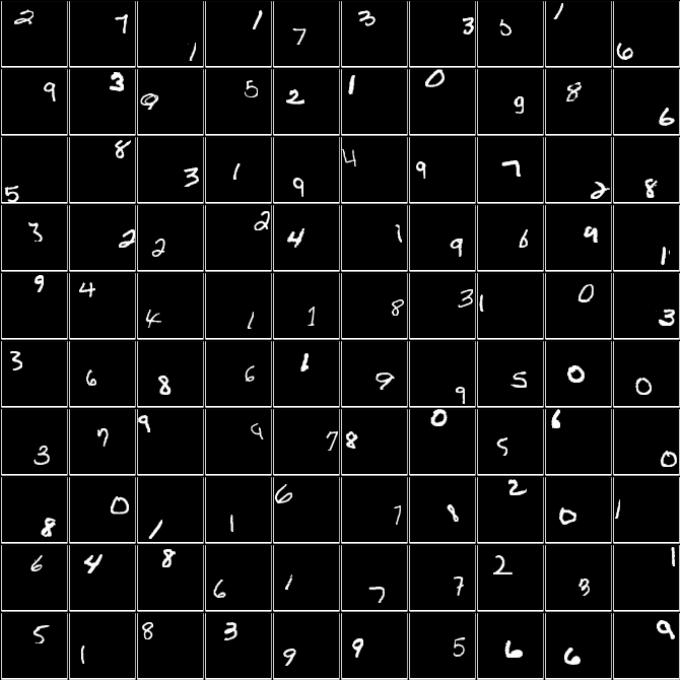
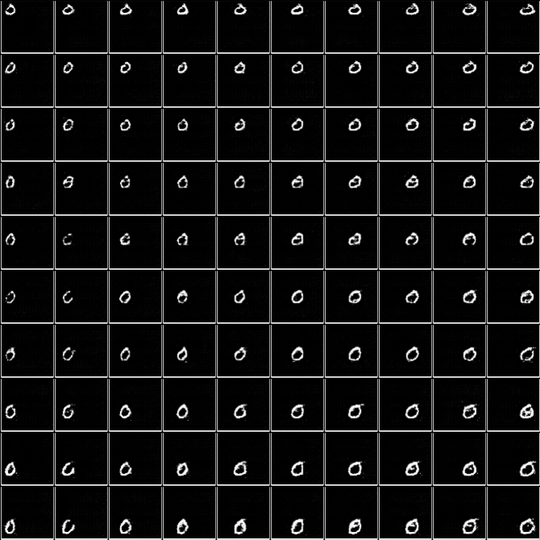
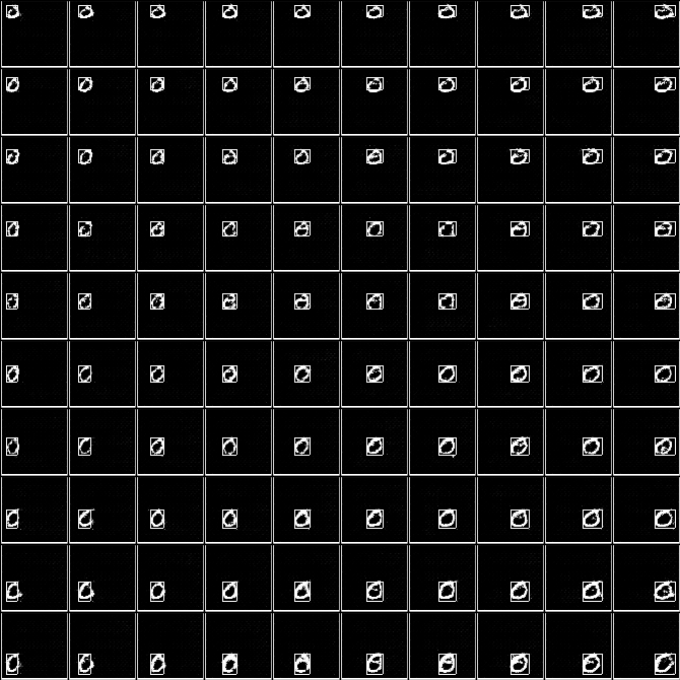
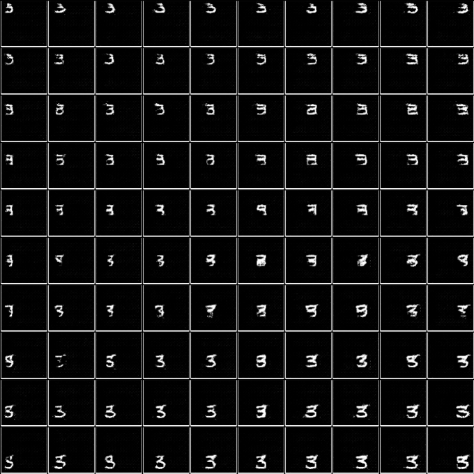
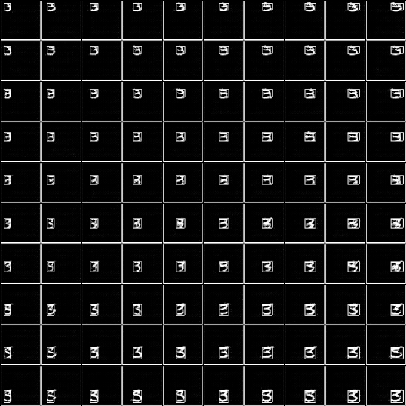
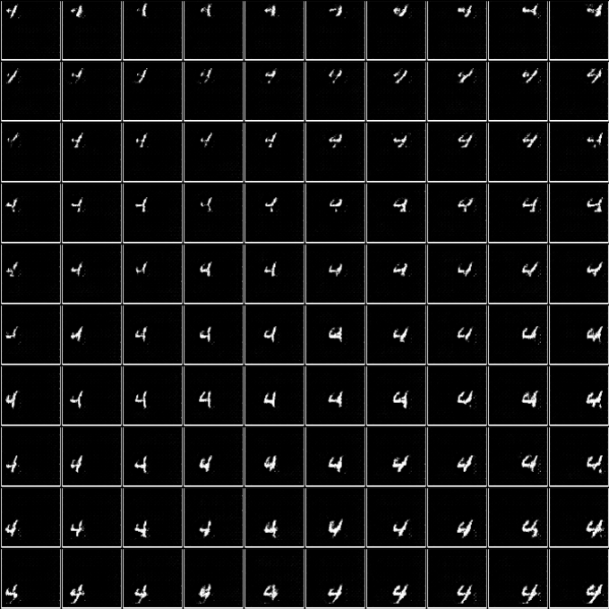
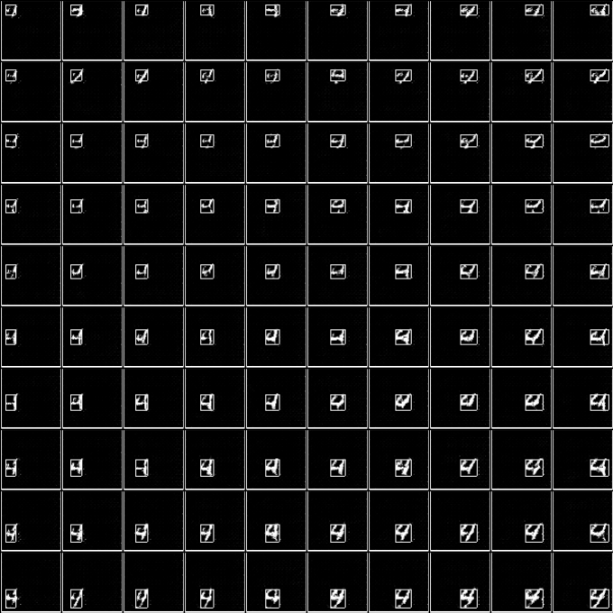
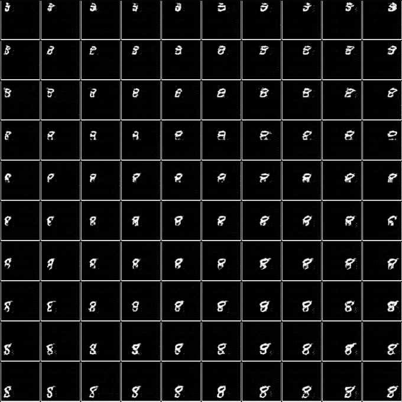
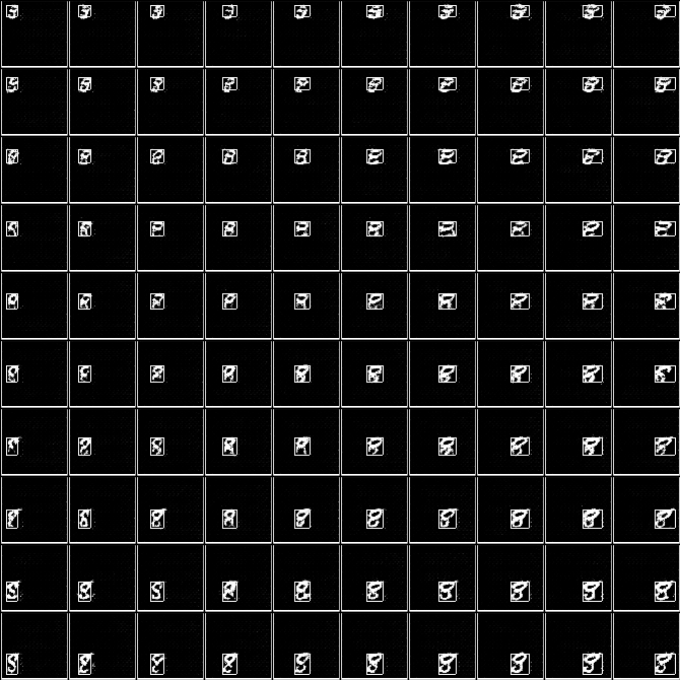

# TF-Learning-What-and-Where-to-Draw
Tensorflow implementation of the NIPS 2016 paper ["Learning What and Where to Draw"](http://papers.nips.cc/paper/6111-learning-what-and-where-to-draw) by Scott Reed et al.

We use a modified MNIST data set for the experiment. The images are of size 64 x 64 pixels, where the mnist images situated randomly within the image. For the generation of the data set we use the (slightly modified) code from [Adnan Akhundov](https://github.com/aakhundov/tf-attend-infer-repeat).

## Acknowledgements
* The code for the spatial transformer network is taken from [Kevin Zakka](https://github.com/kevinzakka/spatial-transformer-network)
* The code for generating the Multi-MNIST data set images is taken from [Adnan Akhundov](https://github.com/aakhundov/tf-attend-infer-repeat)

## Requirements
* Tensorflow 1.5.0

## To Create the Data Set
* run `python multi_mnist.py`
* default values are set to 600 000 images, resolution of (64, 64, 1), with one (possibly stretched) MNIST digit placed somewhere in the image
* data gets stored in folder "positional_mnist_data/1.tfrecords"

## To Run the Experiment
* run `python lwawtd.py`
* to visualize the progress: `tensorboard --logdir log_dir/lwawtd/`

## To Generate Images
* run `python lwawtd_generate.py --model path-to-model-weights`
* this generates images of 10 x 10 sub images for each digit, where the x / y position and height / width of the bounding box increase with each row / column respectively
* possible parameters are:
    * `--digit int-value`: only generates the images containing the specified digit (0-9)
    * `--draw_box`: draws the specified bounding box into the generated images
* generated images are stored under "generated_images"

| Without Bounding Box | With Bounding Box |
|---|---|
|  |  |
|  |  |
|  |  |
|  |  |

## Differences to the Paper
* different data set used 
    * modified MNIST for quicker/easier training
    * as a result our network architecture is smaller (fewer layers and filters, etc)
* we only use digit labels as conditional input (no image captions), therefore our networks are smaller and we require no additional layers to pre-process the image captions
* Discriminator:
    * input image and label are concatenated (along channel axis)
    * two conv layers with stride two process the image 
        * output of second conv layer `d_x_conv_1`: (16, 16, 64)
    * global pathway:
        * input: `d_x_conv_1`
        * two conv layers with stride two process the image
        * output of global pathway: (4, 4, 128)
    * local pathway:
        * input: `d_x_conv_1`
        * apply spatial transfomer network to crop to bounding box
        * two conv layers with stride two process the content of the bounding box
        * output of local pathway: (4, 4, 128)
    * final output:
        * input: concatenation of global and local pathway
        * one dense layer with 512 units
        * output if image is real or generated
* Generator:
    * input noise and label are concatenated and reshaped (via a dense layer) to (4, 4, 128)
    * global pathway:
        * two deconv layers with stride two
        * output is (16, 16, 64)
    * local pathway:
        * two deconv layers with stride two
        * apply spatial transfomer network to crop to bounding box
        * output is (16, 16, 64)
    * final output:
        * input: concatenation of global and local pathway (along channel axis)
        * two deconv layers with stride two upsample the input to (64, 64, 32)
        * final deconv layer produces output image (64, 64, 1)
